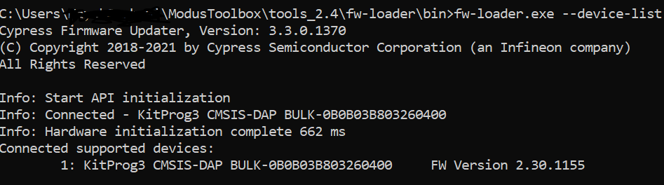
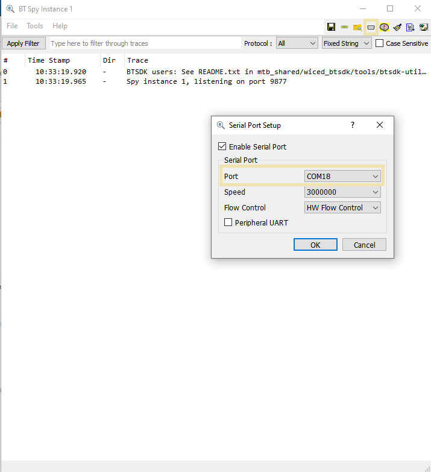

# AIROC&trade; Bluetooth&reg; LE Long Range PHY

This code example demonstrates the use of LE Long Range PHY with Infineon AIROC&trade; CYW20829 Bluetooth&reg; devices.

This code example has two applications:

1. **LE LR Central application (GATT Client):** This application is designed to connect and access services of the 'Hello Sensor' device using LE LR PHY. Because handles of all the attributes of the Hello Sensor device are well known, the GATT Client does not perform GATT discovery, but uses them directly. THe GATT Client assumes that the Hello Sensor device advertises a special UUID and connects to the device which publishes it.

2. **LE LR Peripheral application (GATT Server):** This application demonstrates the implementation of Bluetooth&reg; LE custom service with security. During initialization, the app registers with the LE stack to receive notifications, including bonding complete, connection status change, and peer write. When a device is successfully bonded, the application saves the peer's Bluetooth&#174; Device address to its NVRAM. Bonded devices can also write into the client configuration descriptor of the notification characteristic. That is also saved in the device's NVRAM.  When the user pushes the button, a notification/indication is sent to the bonded and registered host.

[View this README on GitHub.](https://github.com/Infineon/mtb-example-btstack-freertos-le-lr)

[Provide feedback on this code example.](https://cypress.co1.qualtrics.com/jfe/form/SV_1NTns53sK2yiljn?Q_EED=eyJVbmlxdWUgRG9jIElkIjoiQ0UyMzU5NzkiLCJTcGVjIE51bWJlciI6IjAwMi0zNTk3OSIsIkRvYyBUaXRsZSI6IkFJUk9DJnRyYWRlOyBCbHVldG9vdGgmcmVnOyBMRSBMb25nIFJhbmdlIFBIWSIsInJpZCI6InNyZXAiLCJEb2MgdmVyc2lvbiI6IjEuMC4wIiwiRG9jIExhbmd1YWdlIjoiRW5nbGlzaCIsIkRvYyBEaXZpc2lvbiI6Ik1DRCIsIkRvYyBCVSI6IklDVyIsIkRvYyBGYW1pbHkiOiJCVEFCTEUifQ==)

## Requirements

- [ModusToolbox&trade; software](https://www.cypress.com/products/modustoolbox-software-environment) v2.4

- Board support package (BSP) minimum required version: 1.0.0
- Programming language: C
- Associated parts: All [AIROC&trade; CYW20829 Bluetooth&reg; LE SoC](https://www.Infienon.com/cms/en/product/promopages/airoc20829)

## Supported toolchains (make variable 'TOOLCHAIN')

- GNU Arm® embedded compiler v9.3.1 (`GCC_ARM`) - Default value of `TOOLCHAIN`

## Supported kits (make variable 'TARGET')

- [AIROC&trade; CYW920829M2EVB-01](https://www.Infienon.com/cms/en/product/promopages/airoc20829) (`CYW920829M2EVB-01`) – Default value of `TARGET`

## Hardware setup

This example uses the kit’s default configuration. See the respective kit guide to ensure that the kit is configured correctly.

## Software setup

Install a terminal emulator if you don't have one. Instructions in this document use [Tera Term](https://ttssh2.osdn.jp/index.html.en).

## Using the code example

Create the project and open it using one of the following:

<details><summary><b>In Eclipse IDE for ModusToolbox&trade; software</b></summary>

1. Click the **New Application** link in the **Quick Panel** (or, use **File** > **New** > **ModusToolbox Application**). This launches the [Project Creator](https://www.cypress.com/ModusToolboxProjectCreator) tool.

2. Pick a kit supported by the code example from the list shown in the **Project Creator - Choose Board Support Package (BSP)** dialog.

   When you select a supported kit, the example is reconfigured automatically to work with the kit. To work with a different supported kit later, use the [Library Manager](https://www.cypress.com/ModusToolboxLibraryManager) to choose the BSP for the supported kit and deselect the other BSPs. Keep only the required BSP in your application. You can use the Library Manager to select or update the BSP and firmware libraries used in this application. To access the Library Manager, click the link from the **Quick Panel**.

   You can also just start the application creation process again and select a different kit.

   If you want to use the application for a kit not listed here, you may need to update the source files. If the kit does not have the required resources, the application may not work.

3. In the **Project Creator - Select Application** dialog, choose the **LE-LR-Central/Peripheral** by enabling the checkbox.

4. (Optional) Change the suggested **New Application Name**.

5. The **Application(s) Root Path** defaults to the Eclipse workspace which is usually the desired location for the application. If you want to store the application in a different location, you can change the *Application(s) Root Path* value. Applications that share libraries should be in the same root path.

6. Click **Create** to complete the application creation process.

For more details, see the [Eclipse IDE for ModusToolbox&trade; software user guide](https://www.cypress.com/MTBEclipseIDEUserGuide) (locally available at *{ModusToolbox&trade; software install directory}/ide_{version}/docs/mt_ide_user_guide.pdf*).

   **Note:** Both the GATT Server and GATT Client applications are created for the same kit that you have selected in **Step 2**.

</details>

<details><summary><b>In command-line interface (CLI)</b></summary>

ModusToolbox&trade; software provides the Project Creator as both a GUI tool and the command line tool, "project-creator-cli". The CLI tool can be used to create applications from a CLI terminal or from within batch files or shell scripts. This tool is available in the *{ModusToolbox&trade; software install directory}/tools_{version}/project-creator/* directory.

Use a CLI terminal to invoke the "project-creator-cli" tool. On Windows, use the command line "modus-shell" program provided in the ModusToolbox&trade; software installation instead of a standard Windows command-line application. This shell provides access to all ModusToolbox&trade; software tools. You can access it by typing `modus-shell` in the search box in the Windows menu. In Linux and macOS, you can use any terminal application.

This tool has the following arguments:

Argument | Description | Required/optional
---------|-------------|-----------
`--board-id` | Defined in the `<id>` field of the [BSP](https://github.com/Infineon?q=bsp-manifest&type=&language=&sort=) manifest | Required
`--app-id`   | Defined in the `<id>` field of the [CE](https://github.com/Infineon?q=ce-manifest&type=&language=&sort=) manifest | Required
`--target-dir`| Specify the directory in which the application is to be created if you prefer not to use the default current working directory | Optional
`--user-app-name`| Specify the name of the application if you prefer to have a name other than the example's default name | Optional

<br>

The following example will clone the "[Hello World](https://github.com/Infineon/mtb-example-psoc6-hello-world)" application with the desired name "MyHelloWorld" configured for the *CY8CKIT-062-WIFI-BT* BSP into the specified working directory, *C:/mtb_projects*:

   ```
   project-creator-cli --board-id CY8CKIT-062-WIFI-BT --app-id mtb-example-psoc6-hello-world --user-app-name MyHelloWorld --target-dir "C:/mtb_projects"
   ```

**Note:** The project-creator-cli tool uses the `git clone` and `make getlibs` commands to fetch the repository and import the required libraries. For details, see the "Project creator tools" section of the [ModusToolbox&trade; software user guide](https://www.cypress.com/ModusToolboxUserGuide) (locally available at *{ModusToolbox&trade; software install directory}/docs_{version}/mtb_user_guide.pdf*).

</details>

<details><summary><b>In third-party IDEs</b></summary>

Use one of the following options:

- **Use the standalone [Project Creator](https://www.cypress.com/ModusToolboxProjectCreator) tool:**

   1. Launch Project Creator from the Windows Start menu or from *{ModusToolbox&trade; software install directory}/tools_{version}/project-creator/project-creator.exe*.

   2. In the initial **Choose Board Support Package** screen, select the BSP, and click **Next**.

   3. In the **Select Application** screen, select the appropriate IDE from the **Target IDE** drop-down menu.

   4. Click **Create** and follow the instructions printed in the bottom pane to import or open the exported project in the respective IDE.

<br>

- **Use command-line interface (CLI):**

   1. Follow the instructions from the **In command-line interface (CLI)** section to create the application, and then import the libraries using the `make getlibs` command.

   2. Export the application to a supported IDE using the `make <ide>` command.

   3. Follow the instructions displayed in the terminal to create or import the application as an IDE project.

For a list of supported IDEs and more details, see the "Exporting to IDEs" section of the [ModusToolbox&trade; software user guide](https://www.cypress.com/ModusToolboxUserGuide) (locally available at *{ModusToolbox&trade; software install directory}/docs_{version}/mtb_user_guide.pdf*).

</details>

## Operation

1. Connect the two boards to your PC using the provided USB cable through the USB connector.

2. Open a terminal program and select the KitProg3 COM port. Set the serial port parameters to 8N1 and 115200 baud. You need two windows of the terminal application to view messages from the GATT Server device and the GATT Client device.

3. Program one board with the "le_lr_central" application and the other with the "le_lr_peripheral" application.

   <details><summary><b>Using Eclipse IDE for ModusToolbox&trade; software</b></summary>

      1. Select the application project in the Project Explorer.

      2. In the **Quick Panel**, scroll down, and click **\<Application Name> Program**.
   </details>

   <details><summary><b>Using CLI</b></summary>

     From the terminal, execute the `make program` command to build and program the application using the default toolchain to the default target. The default toolchain and target are specified in the application's Makefile but you can override those values manually:
      ```
      make program TARGET=<BSP> TOOLCHAIN=<toolchain>
      ```

      Example:
      ```
      make program TARGET=CYW920829M2EVB-01 TOOLCHAIN=GCC_ARM
      ```

    </details>

   After programming, the application starts automatically.

4. Push the user button on the Peripheral to start advertising.

5. Push the user button on the Central board to start the connection process.

6. Scan and pair from the Central application.

7. The Peripheral application will start sending notifications to the Client.

8. Press the user button on the Peripheral application to switch between S=2/S=8 encoding algorithms.

## Programming a CYW20829 board (when multiple boards are connected)

### Get the board's serial number

1. Connect the board to your machine.

2. Go to *C:\Users\<USERNAME>\ModusToolbox\tools_2.4\fw-loader\bin* and open the command prompt.

3. Run the following command:

   ```
   fw-loader.exe --device-list
   ```

   

4. On the text that appears, locate the following message starting with ```Connected supported devices:```.

5. Note the 16-digit number that is listed. This is the serial number of the board.

   In this example, `0B0B03B803260400` is the serial number for the board.

### From the CLI

1. Go to your application and open the Makefile.

2. Add the following to the Makefile (in the "Advanced Configuration" section):

   ```
   CY_OPENOCD_CUSTOM_COMMAND += cmsis_dap_serial <SERIAL_NUMBER>;
   ```

   **Note:** Ensure that a semicolon is added at the end of line as shown above.

You can program the board using the `make program` command from ModusToolbox&trade; Terminal.

### From the IDE (via launch configurations available in Quick Panel)

On Eclipse IDE for ModusToolbox&trade software, you need to edit the 'Program' configurations to bind them with a specific CMSIS-DAP serial number. See the following sections of the ModusToolbox&trade user guide:
    - 5.1.6 Select specific CMSIS-DAP device
    - 5.1.6.2 Selecting by serial number

1. Select **Run** > **Debug Configurations**, and then select **GDB OpenOCD Debugging** on the Create, manage and run configurations window.

2. Select "le_lr_central Program(KP3_MiniProg4)".

3. On the right pane, select the **Debugger** tab.

4. In **Config options**, insert the following line after ``` -c "source [find interface/kitprog3.cfg]"```:

    ```-c "cmsis_dap_serial <serial_num_1>"```

5. Select **Apply** and **Debug** for the change to take effect.

6. Similar to Step 2, select "le_lr_peripheral Program(KP3_MiniProg4)".

7. On the right pane, select the **Debugger** tab.

8. In **Config options**, insert the following  line after ```-c "source [find interface/kitprog3.cfg]"```:

   ```-c "cmsis_dap_serial <serial_num_2>"```

9. Click **Apply** and **Debug** for the change to take effect.

## Open BTSpy to receive traces

1. Open BTSpy from the Quick Panel of ModusToolbox&trade; software.

2. Open **Serial Port Setup** as follows:

   

   The **Port** list should have two COM ports listed per board.

3. Try opening each port to identify the one receiving the traces (you need to do this only once; the port will not change even on reconnection).

4. You should see all the application traces and the Bluetooth&reg; HCI messages. These messages are helpful in  debugging the HCI commands issued to the Bluetooth&reg; controller. Application traces indicate the start/stop of advertisements, connection/disconnection, and PHY updates.

## Design and implementation

### LE-LR

LE-LR represents LE Long Range PHY. This CE demonstrates the use of LE LR PHY to advertise, scan for advertisements, and connect.

The mandatory symbol rate is 1 megasymbol per second (Msym/s), where 1 symbol represents 1 bit therefore supporting a bit rate of 1 megabit per second (Mb/s), which is referred to as the LE 1M PHY.

The 1 Msym/s symbol rate may optionally support error correction coding, which is referred to as the LE Coded PHY. This may use either of two coding schemes: S=2, where 2 symbols represent 1 bit therefore supporting a bit rate of 500 kb/s, and S=8, where 8 symbols represent 1 bit therefore supporting a bit rate of 125 kb/s.

### Program

The code example configures the device as a Bluetooth® LE GAP Peripheral/Central and GATT Server/Client. The example implements a custom GATT profile that includes the following three services:

- Hello Sensor custom service
- Device Information service
- Battery Level service

The Hello Sensor service includes a custom characteristic - *Notify*. The Notify characteristic is used to send a notification or indication to the peer client device upon connection.

The application uses a UART resource from the Hardware Abstraction Layer (HAL) to send debug messages on a UART terminal emulator. The UART resource initialization and retargetting of standard I/O to the UART port are done using the retarget-io library.

Upon reset, the applications start automatically and initializes the Bluetooth&reg; stack and other device peripherals. The peripheral device starts to advertise its presence to the peer central devices using LE-LR PHY when a button press is detected. The client device scans for the peripheral device upon button press.

Once a Bluetooth® LE connection is established, the peer client device registers for notifications to be received by using the CCCD handle of the Notify characteristic. Because the CCCD handle of the Notify characteristic requires write authentication, an attempt to enable notification/indication will trigger the pairing process at the Central side.

Once the pairing process completes, the peer device's link keys and addresses are stored in the device's flash memory and therefore bonded.

The user button on the board is configured to trigger an interrupt on falling edge. When the onboard user button is pressed, the peripheral device will switch the coding algorithm between S=2 and S=8 and notify using the modified coding algorithm.

## Related resources

Resources  | Links
-----------|----------------------------------
Application notes  | [AN228571](https://www.cypress.com/AN228571) – Getting started with PSoC&trade; 6 MCU on ModusToolbox&trade; software <br />  [AN215656](https://www.cypress.com/AN215656) – PSoC&trade; 6 MCU: Dual-CPU system design
Code examples on GitHub | [Using ModusToolbox&trade; software](https://github.com/Infineon/Code-Examples-for-ModusToolbox-Software) <br> [Using Bluetooth&reg; SDK](https://www.cypress.com/documentation/code-examples/bluetooth-sdk-code-examples)
Device documentation | [AIROC™ CYW20829 Bluetooth® LE SoC](https://www.Infienon.com/cms/en/product/promopages/airoc20829/)
Libraries on GitHub  | [mtb-pdl-cat1](https://github.com/Infienon/mtb-pdl-cat1) – PSoC&trade; 6 Peripheral Driver Library (PDL)  <br /> [mtb-hal-cat1](https://github.com/Infienon/mtb-hal-cat1) – Hardware Abstraction Layer (HAL) library <br /> [retarget-io](https://github.com/Infienon/retarget-io) – Utility library to retarget STDIO messages to a UART port
Middleware on GitHub  | [psoc6-middleware](https://github.com/Infineon/modustoolbox-software#psoc-6-middleware-libraries) – Links to all PSoC&trade; 6 MCU middleware
Tools  | [Eclipse IDE for ModusToolbox&trade; software](https://www.cypress.com/modustoolbox) – ModusToolbox&trade; software is a collection of easy-to-use software and tools enabling rapid development with Infineon MCUs, covering applications from embedded sense and control to wireless and cloud-connected systems using AIROC&trade; Wi-Fi and Bluetooth® connectivity devices.
<br>

## Other resources

Infineon provides a wealth of data at www.Infineon.com to help you select the right device, and quickly and effectively integrate it into your design.

## Document history

Document title: *CE235979* – *AIROC&trade; Bluetooth&reg; LE Long Range PHY*

Revision | Description of change
-------  | ---------------------
1.0.0    | New code example

---------------------------------------------------------

© Cypress Semiconductor Corporation, 2022. This document is the property of Cypress Semiconductor Corporation, an Infineon Technologies company, and its affiliates ("Cypress").  This document, including any software or firmware included or referenced in this document ("Software"), is owned by Cypress under the intellectual property laws and treaties of the United States and other countries worldwide.  Cypress reserves all rights under such laws and treaties and does not, except as specifically stated in this paragraph, grant any license under its patents, copyrights, trademarks, or other intellectual property rights.  If the Software is not accompanied by a license agreement and you do not otherwise have a written agreement with Cypress governing the use of the Software, then Cypress hereby grants you a personal, non-exclusive, nontransferable license (without the right to sublicense) (1) under its copyright rights in the Software (a) for Software provided in source code form, to modify and reproduce the Software solely for use with Cypress hardware products, only internally within your organization, and (b) to distribute the Software in binary code form externally to end users (either directly or indirectly through resellers and distributors), solely for use on Cypress hardware product units, and (2) under those claims of Cypress’s patents that are infringed by the Software (as provided by Cypress, unmodified) to make, use, distribute, and import the Software solely for use with Cypress hardware products.  Any other use, reproduction, modification, translation, or compilation of the Software is prohibited.
<br>
TO THE EXTENT PERMITTED BY APPLICABLE LAW, CYPRESS MAKES NO WARRANTY OF ANY KIND, EXPRESS OR IMPLIED, WITH REGARD TO THIS DOCUMENT OR ANY SOFTWARE OR ACCOMPANYING HARDWARE, INCLUDING, BUT NOT LIMITED TO, THE IMPLIED WARRANTIES OF MERCHANTABILITY AND FITNESS FOR A PARTICULAR PURPOSE.  No computing device can be absolutely secure.  Therefore, despite security measures implemented in Cypress hardware or software products, Cypress shall have no liability arising out of any security breach, such as unauthorized access to or use of a Cypress product. CYPRESS DOES NOT REPRESENT, WARRANT, OR GUARANTEE THAT CYPRESS PRODUCTS, OR SYSTEMS CREATED USING CYPRESS PRODUCTS, WILL BE FREE FROM CORRUPTION, ATTACK, VIRUSES, INTERFERENCE, HACKING, DATA LOSS OR THEFT, OR OTHER SECURITY INTRUSION (collectively, "Security Breach").  Cypress disclaims any liability relating to any Security Breach, and you shall and hereby do release Cypress from any claim, damage, or other liability arising from any Security Breach.  In addition, the products described in these materials may contain design defects or errors known as errata which may cause the product to deviate from published specifications. To the extent permitted by applicable law, Cypress reserves the right to make changes to this document without further notice. Cypress does not assume any liability arising out of the application or use of any product or circuit described in this document. Any information provided in this document, including any sample design information or programming code, is provided only for reference purposes.  It is the responsibility of the user of this document to properly design, program, and test the functionality and safety of any application made of this information and any resulting product.  "High-Risk Device" means any device or system whose failure could cause personal injury, death, or property damage.  Examples of High-Risk Devices are weapons, nuclear installations, surgical implants, and other medical devices.  "Critical Component" means any component of a High-Risk Device whose failure to perform can be reasonably expected to cause, directly or indirectly, the failure of the High-Risk Device, or to affect its safety or effectiveness.  Cypress is not liable, in whole or in part, and you shall and hereby do release Cypress from any claim, damage, or other liability arising from any use of a Cypress product as a Critical Component in a High-Risk Device. You shall indemnify and hold Cypress, including its affiliates, and its directors, officers, employees, agents, distributors, and assigns harmless from and against all claims, costs, damages, and expenses, arising out of any claim, including claims for product liability, personal injury or death, or property damage arising from any use of a Cypress product as a Critical Component in a High-Risk Device. Cypress products are not intended or authorized for use as a Critical Component in any High-Risk Device except to the limited extent that (i) Cypress’s published data sheet for the product explicitly states Cypress has qualified the product for use in a specific High-Risk Device, or (ii) Cypress has given you advance written authorization to use the product as a Critical Component in the specific High-Risk Device and you have signed a separate indemnification agreement.
<br>
Cypress, the Cypress logo, and combinations thereof, WICED, ModusToolbox, PSoC, CapSense, EZ-USB, F-RAM, and Traveo are trademarks or registered trademarks of Cypress or a subsidiary of Cypress in the United States or in other countries. For a more complete list of Cypress trademarks, visit cypress.com. Other names and brands may be claimed as property of their respective owners.
